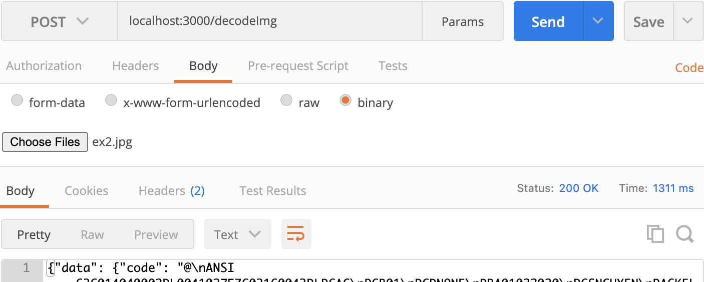
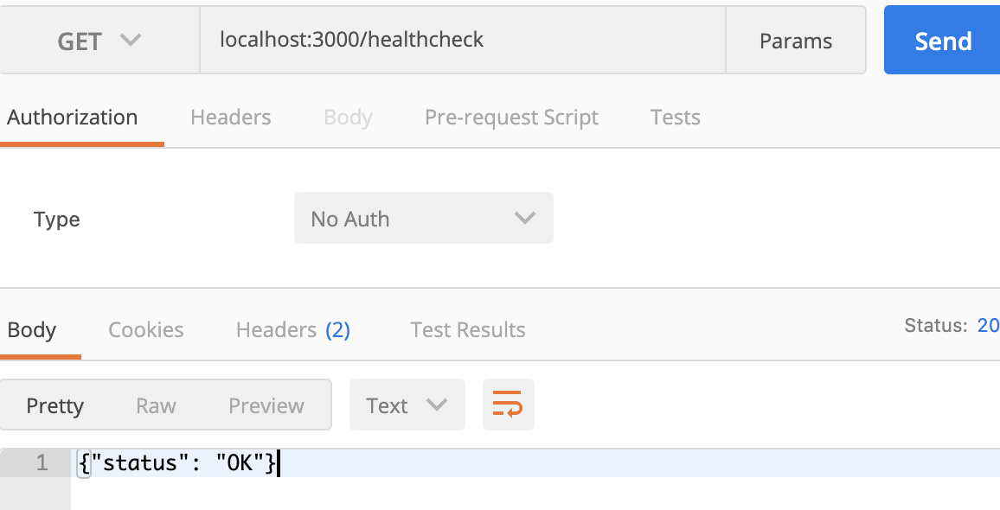

## Build Image

* Option 1: `Run from dockerfile`
    ```
        ./rundocker.sh 
    ```
* Option 2: `Run from docker-compose`
    ```
        ./rundockerCompose.sh 
    ```

## Test API
* `Decode The PDF417 Image:` 


* `Service Healthcheck:` 



